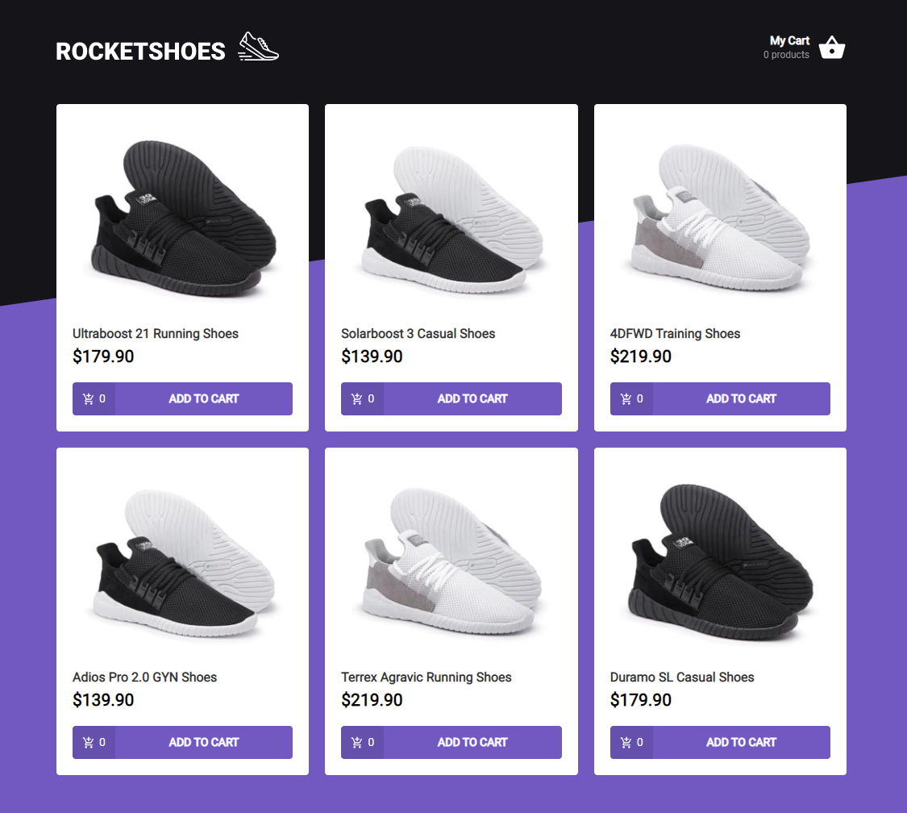

<div align="center">
  
</div>

<h1 align="center"> RocketSeat 🔥 Ignite ReactJS </h1>

<h2 align="center"> challenge 01 : Componentizing the App ( Project Rocketshoes ) </h2>

<p align="center">
  <a href="https://rocketseat.com.br">
    
</p>

## 🚀 About the Project
This will be an application where your main objective is to create a shopping cart hook. You will have access to two pages, a component and a hook to implement the features requested in this challenge:

* Add a new product to your cart
* Remove a product from the cart
* Change the quantity of a product in the cart
* Calculation of sub-total and total cart prices
* Stock validation
* Displaying error messages
* Between others

## 💻 Project Image

<div align="center">
    
   </br>
</div>

## 🧰 Technologies
This project was developed with the following technologies:
* Typescript
* ReacJS
* Axios
* Unform
* Styled Components
* Json Server
* React-Icons
* Polished
* React-Toastify

## ⚙️ Installation
```bash
# You need to install Node.js, then in order to clone the project via HTTPS, run this command:
$ https://github.com/LeonardoMarquesDias/Rocketshoes-Cart-ReactJS.git
# or use the download option.

# Install dependencies
$ yarn install
or
$ npm install

# Run the following command to start the fake API with JSON Server to simulate an API that has foods information:
$ yarn server
or
$ npm server

# Run the following command to start the application in a development environment:
$ yarn start
or
$ npm start

# Access http://localhost:3000 
```
## 🌐 Reference

[challenge 01 - Rocketshoes](https://www.notion.so/Desafio-01-Criando-um-hook-de-carrinho-de-compras-5769216778794019a83f544e79167b12) - Notion Info.


## 📝 License

This project is licensed under the MIT License - see the LICENSE file for details.

---

by [Leonardo Dias](https://github.com/LeonardoMarquesDias) 😛

